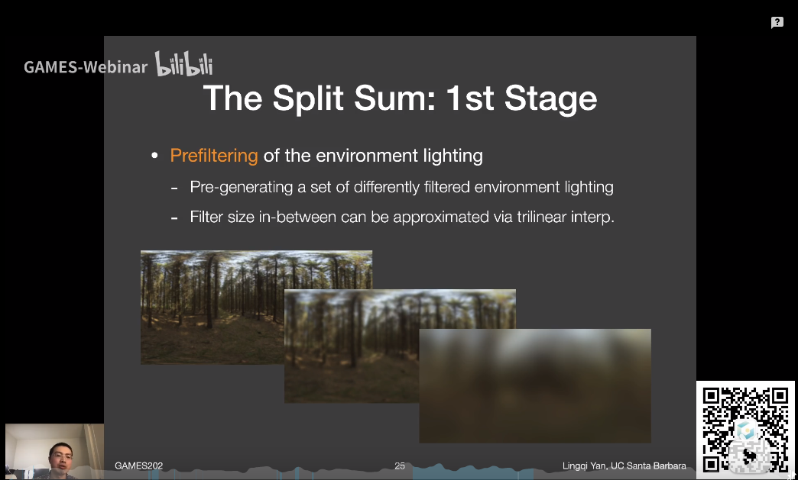

## 环境光照

环境光照从无限远的地方向整个场景投射的光照，场景中的不同物体都会接收到相同的环境光照。环境光照的目的是在不考虑可见性的情况下解RE（因为物体在环境中永远可见）

- 对环境光照而言，用蒙特卡洛方法求解RE的成本过高（场景中每个fragment都要求解）
- 考虑RE：

$$
L_o(p, \omega_o) = \int_{\Omega+} L_i(p, \omega_i) f_r(p, \omega_i, \omega_o)V(p, \omega_i) d \omega_i,
$$
当物体是glossy的时候，$f_r$的有效区域较小，当物体是diffuse的时候，$f_r的值变化很缓慢（常数），因此可以对RE进行近似：

$$
L_o(p, \omega_o) \approx \frac{\int_{\Omega_G} L_i(p, \omega_i) d \omega_i}{\int_{\Omega_G}  d \omega_i} \int_{\Omega+} f_r(p, \omega_i, \omega_o) cos\theta_i d \omega_i,
$$

这里$\Omega_G$是BRDF项的作用范围，上面的近似表示将环境光照的BRDF通过近似卷积的形式模糊化，而在渲染之前，我们就可以提前对环境贴图进行滤波，减少开销

- 在使用时，我们可以根据预计算好的这个经过模糊的环境贴图，直接根据观察方向取得其对应的RGB值

- 第二个问题是如何把RE的后半部分的积分也近似化，这里可以考虑BRDF使用菲涅尔项时候的形式，将式子改写为：

$$
\int_{\Omega+} f_r(p, \omega_i, \omega_o) cos\theta_i d \omega_i \approx R_0 \int_{\Omega+} \frac { f_r(p, \omega_i, \omega_o) }{F} (1- (1-cos\theta^5))cos\theta_i d \omega_i  + \int_{\Omega+} \frac { f_r(p, \omega_i, \omega_o) }{F} (1-cos\theta^5)cos\theta_i d \omega_i
$$

- 环境光照的阴影非常困难，因为环境贴图中的每个点都可以认为是一个光源，第二个理解是环境光照中的可见项$V$难以求解。
- 对于某些特殊情况，环境光遮蔽（SSO）可以求解。目前常用的方法是针对环境光中最亮的一个区域，生成阴影（只考虑一小片光源）