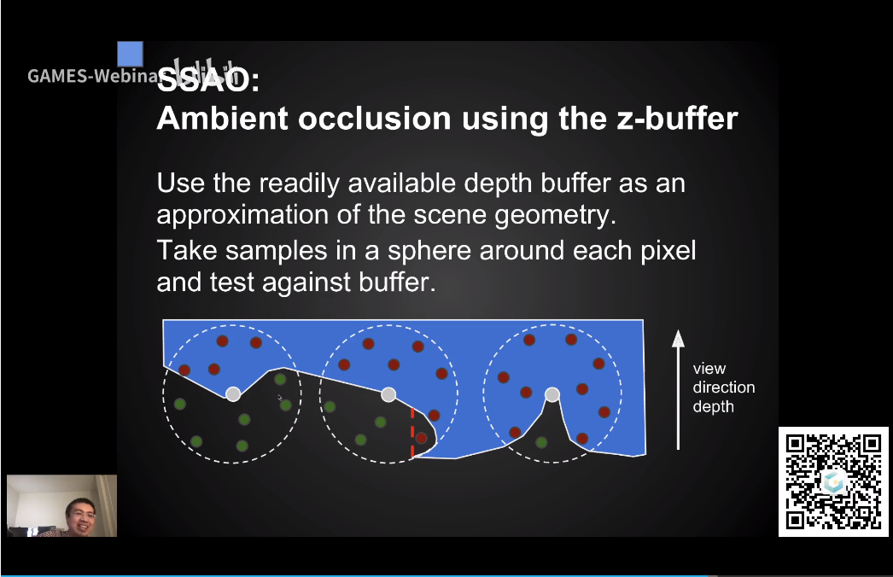

## SSAO

- 假设1：间接光照是一个常数（类似于Phong模型的diffuse）
- 假设2：每个物体由于可见性，不可能都能接收到相同程度的光（这是与Phong模型不同的地方）
- 假设3：物体是diffuse的

- 思路：对每个物体，向四面八方看去（随机采样），如果有很多光线被遮蔽，那么这一点的可见性就差一些，因此应该更暗

- 考虑RE以及其近似：

$$
L_o(p, \omega_o) = \int_{\Omega+} L_i(p, \omega_i) f_r(p, \omega_i, \omega_o)V(p, \omega_i) d \omega_i
$$

$$
L_o(p, \omega_o) =\frac{\int_{\Omega_+}V(p,\omega_i)cos\theta_i d\omega_i} {\int_{\Omega+} cos\theta_i d \omega_i} \int_{\Omega+} L_i(p, \omega_i) f_r(p, \omega_i, \omega_o)cos\theta_i d \omega_i
$$

- 对于近似的前半部分记作$k_A$，半球上cos的积分是$\pi$,因此对于每一个fragment，前半部分的值就等于它采样可见性按照cos的加权平均值再除以$\pi$
- 对于近似的后半部分，由于假设1和3，$L_i$和$f_r$都是常数，因此后半部分的值等于$L_i * \frac {\rho}{\pi} * \pi  = L_i * \rho$

- 这个近似对SSAO是严格准确的

- 接下来的目标就是计算$k_A$, 在这里，我们对可见性的定义需要加以限制，即只要在fragment周围有限范围内没有被遮挡的光线，就认为它是可见的。因为如果不加以限制，最终每个光线都会在无限远的地方（墙壁，天空）被判定为遮挡
- 对于判定可见性，在世界坐标中，可以通过ray-tracing的方式在一个半球中判定可见性，但对于SSAO，ray-tracing的成本太高了，因此采用一种近似的方式：

- 对每个fragment，在一个球（为什么不是半球？）里采样若干点，并判断深度是否小于gDepth，如果小于，那么这一个采样点就认为是不可见的
- 解决上面的问题，为什么不是半球，是因为SSAO提出时假设每个点的法线是未知的，此时就在整个球上采样，如果被遮挡的点大于一半，再计算后面的AO，否则就直接当作全部可见。如果预先知道每个点的normal，那么就只用在半球上采样就可以了
- 采样法由于不知道法线信息，因此RE中的cos项也是缺失的，不过效果可以接受
- 现在的大部分渲染方法都能够获得法线方向