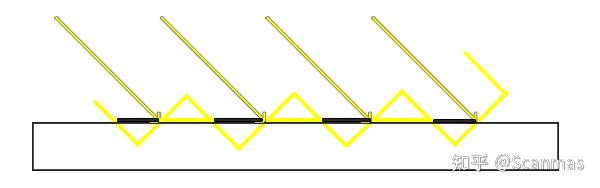
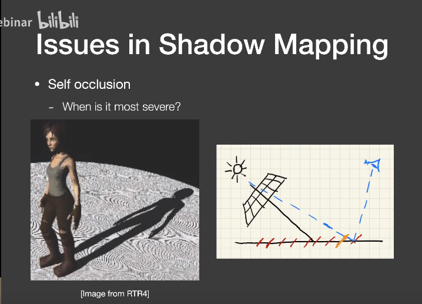

## 实时阴影渲染

### 复习：Shadow Mapping
- shadowmap的流程是先从点光源的位置向场景投射，记录下摄像机在点光源处的最小深度，形成shadowmap，在从真正的摄像机的位置开始渲染，深度大于该位置对应的shadowmap的像素就都渲染成黑色就可以
- shadowmap的深度是从光源看过去的深度，与屏幕空间的深度可能并不一致
- shadowmap的做法有两个主要的缺点：自遮挡和锯齿

#### 自遮挡
- 自遮挡出现的原因是因为：物体中场景的深度总是离散的浮点数，在场景中离光源较远的pixel可能覆盖率若干个Texel，所以在以pixel采样深度的时候，无法保证采样到哪个Texel上，所以就会出现：一些像素采样小于实际深度，另一些大于实际深度
    
    这里箭头所指的方向就是摄像机的观察方向，黑色部分是可见部分部分，因为他们的shadowmap在实际深度下面，黄色直线就是错误的阴影部分
    
    这里同样是一个例子
- **解决方案一**：
是给shadowmap加一个很小的bias，让shadowmap整体下移一部分，或者摄像机视角的深度上移一部分就可以解决。bias也不能太大，否则会出现阴影的错位
- **解决方案2**：记录从光源看去深度的最小值和次小值，以它们的平均值作为shadowmap的实际深度值

#### 走样
- 锯齿出现的原因是因为：从点光源向某个场景渲染的时候，最近的物体处在视锥的靠前的位置，但阴影会渲染在靠后的背景上，因此物体的一个pixel可能会遮挡住背景上的若干个pixel，表现出来就是阴影的锯齿很明显

#### shadowmap的实现
硬阴影的产生主要依靠Shadow Map实现，核心是two pass算法。two pass算法的流程可以简单描述为：将摄像机摆放在光源的位置（面光源也会简化为点光源），朝整个场景看去，利用深度测试记录各个像素上的最小深度，得到一张shadow map；之后再从真正的摄像机位置出发，以从摄像机角度看去的深度与shadowmap比较，如果某个的像素的深度大于shadowmap的值，那么意味着这个位置就应该被阴影覆盖，也就是这个像素的gl_Color应该为0

```
float useShadowMap(sampler2D shadowMap, vec4 shadowCoord){
  
  // return vec4(texture2D(shadowMap, vTextureCoord)).x;
  vec3 temp = shadowCoord.xyz;
  temp = temp * 0.5 + 0.5;
  vec4 depthpack = texture2D(shadowMap, temp.xy);
  float depthUnpack = unpack(depthpack);

  if(depthUnpack > temp.z - EPS)
      return 1.0;
  
  return 0.0;

}

```

### PCF

PCF的核心思想是利用随机采样+卷积，实现边界的柔化，这一点很好理解，因为柔化阴影边缘本质上就是对阴影边界做一个模糊，而因为阴影内部都是黑色的，因此全局模糊和局部模糊看起来也没区别。实现图像的模糊或者锐化，卷积是最常用的手段：

```
float PCF(sampler2D shadowMap, vec4 coords) {

  vec3 temp = coords.xyz;
  float res = 0.0;
  temp = temp * 0.5 + 0.5;
  for(int i = 0; i < NUM_SAMPLES; i++){
    vec3 random_coord = vec3(temp.x+ poissonDisk[i].x * KERNEL_SIZE, temp.y + poissonDisk[i].y * KERNEL_SIZE, temp.z);
    vec4 depthpack = texture2D(shadowMap, random_coord.xy);
    
    float depthUnpack = unpack(depthpack);

    if(depthUnpack > temp.z - EPS){
      res += 1.0;
    }
  }
  res = res / float(NUM_SAMPLES);
  return res;
}
```
这里的`poissonDisk`是一个随机数组，它可以保证我们在给定的`coords`周围采样`NUM_SAMPLES`次,`KERNEL_SIZE`用来控制卷积范围的大小，需要注意，这里最好能保证每个随机位置尽量落在不同的像素上，即`KERNEL_SIZE`最好是像素大小的整数倍

PCF解决了柔化边缘的问题，但它仍然无法完成阴影边缘的渐变模糊

### PCSS

PCSS相比PCF，主要改进了卷积尺寸，实现了阴影背景与物体之间距离较近时，阴影较锐利，距离较远时，阴影较模糊
```
float PCSS(sampler2D shadowMap, vec4 coords){

  vec3 temp = coords.xyz;
  float res = 0.0;
  temp = temp * 0.5 + 0.5;
  float avg_depth = findBlocker(shadowMap, temp.xy, temp.z);
  float adaptive_size = KERNEL_SIZE * LIGHT_WIDTH * (temp.z - avg_depth + EPS) / (avg_depth + EPS);

  for(int i = 0; i < NUM_SAMPLES; i++){
    vec3 random_coord = vec3(temp.x+ poissonDisk[i].x * adaptive_size, temp.y + poissonDisk[i].y * adaptive_size, temp.z);
    vec4 depthpack = texture2D(shadowMap, random_coord.xy);
    
    float depthUnpack = unpack(depthpack);

    if(depthUnpack > temp.z -EPS){
      res += 1.0;
    }
  }
  res = res / float(NUM_SAMPLES);
  return res;
  
  return 1.0;

}
```