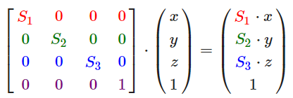
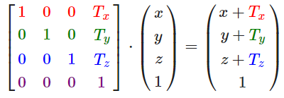
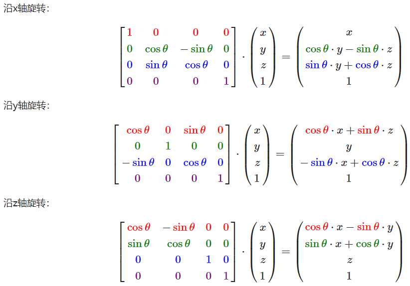

## OpenGL的模型、视图、投影

### MVP的概念
MVP矩阵是在二维屏幕上建模三维物体的基本操作，包含三个步骤：
- Model：包含物体的平移、缩放、旋转等变换
- View：包含摄像机（视角）的移动
- Projection：决定了从三维投影到二维的方式

通过分离MVP的方式，我们可以灵活实现不同的效果，这一部分的知识与图形学（GAMES101）有非常密切的关系，具体的原理会在那一部分中有更向西的介绍，这里更多涉及其实现方式 （**在写这一块的时候，还没有复习GAMES101，所以如果可能的话后面会补充**）

### Model矩阵
Model包括单个物体的平移、旋转、缩放等操作，这些统一被称为变换（Transformation）
- 缩放是指物体的xyz坐标各自进行压缩或者扩张，用矩阵的方式可以表示为：



- 平移：平移是指在xyz坐标上各自加上不同的数值，表现在物体不改变形状的前提下，在空间中的位置会改变，矩阵形式表示为：



- 旋转：旋转相对复杂，并且会有很多潜在的问题（万向节死锁），但通俗来说，旋转是在不改变物体形状的前提下，沿某个轴或者某几个轴改变物体的朝向



这个例子是沿xyz轴旋转，但更通用的解决方法是四元数

### View矩阵
View可以认为表达了摄像机所处的位置、朝向、张角等，
为了表示一个摄像机，我们需要定义它的位置以及朝向的方向，朝向的方向定义了摄像机的左右、上下以及前后，也就是摄像机的xyz轴，理论上我们需要定义三个向量，但实际上，我们可以用两个向量的叉乘得到第三个向量，因此，我们需要定义的就是摄像机的位置，朝向方向的向量，以及上下方向的向量三个向量。

### Projection矩阵
Projection的作用是把三维的物体在二维的屏幕上显示，常用的投影分为平行投影和透视投影两种
- 平行投影没有远近关系，因此看起来可能会比较诡异，但平行投影的实现相当简单，而且在某些不太关注实际效果的场合，可能更好地观察物体的细节

- 透视投影加入了近大远小的关系


### 在OpenGL中的实现：
glm是一个只有头文件的数学库，MVP都有对应的函数可以直接调用，例如`glm::rotate`，`glm::perspective`等，初始的MVP都是单位矩阵

- Model：
    ```
    // 初始化model矩阵
    model = glm::mat4(1.0f);

    // 旋转
    model = glm::rotate(model, glm::radians(angle), glm::vec3(1.0f, 0.3f, 0.5f));

    // 缩放
    model = glm::scale(model, glm::vec3(0.5, 0.5, 0.5));

    // 平移
    model = glm::translate(model, glm::vec3(1.0f, 1.0f, 0.0f));
    ```
    
    各个函数的参数不再介绍

- View：
    ```

    view = glm::lookAt(cameraPos, cameraPos + cameraFront, cameraUp);
    ```

    - lookAt很方便地实现了view矩阵的定义，注意相机位置、向上方向以及向前方向还是我们人为定义的
    - 更多的场景下，相机可以随着输入而移动（例如大多数FPS游戏），我们只需要根据输入改变对应的cameraUp和cameraFront就可以实现

- Projection:
    ```
    projection = glm::perspective(fov, float(800) / float(600), 0.1f, 100.0f);
    ```

    - `perspective`的第一个参数定义了视野的大小，一般设置为45.0f，如果设置更小，就会出现类似鱼眼镜头的效果，反之如果增大，就会获得更广但是内凹的视觉效果。第二个参数是宽高比，一般需要保持跟屏幕尺寸相同。第三和第四个参数分别是近平面与远平面的距离，他们的作用在GAMES101中进行详细的介绍。


### 修改shader

```
#version 330 core
layout (location = 0) in vec3 aPos;
...
uniform mat4 model;
uniform mat4 view;
uniform mat4 projection;

void main()
{
    // 注意乘法要从右向左读
    gl_Position = projection * view * model * vec4(aPos, 1.0);
    ...
}
```

实现MVP操作，只需要通过`glUniform`将MVP传进shader即可。